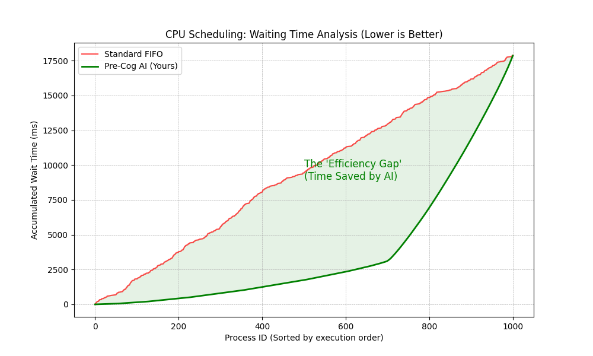

# Pre-Cog: AI-Accelerated OS Scheduler

## Overview
Pre-Cog is a custom Operating System Process Scheduler written in C++. It replaces standard round-robin scheduling with a **Predicted Shortest Job First (PSJF)** algorithm. By using **Exponential Moving Average (EMA)**—a technique borrowed from CPU branch prediction—it estimates future CPU burst times to minimize process starvation and context switching.

## Key Features
* **AI-Driven Priority:** Uses historical execution data to predict future CPU needs with $O(1)$ complexity.
* **Pre-Emptive MLFQ:** Automatically detects "heavy" processes and migrates them to lower-priority queues *before* they block interactive tasks.
* **Hybrid Architecture:** C++ Core Engine for logic + Python Data Pipeline for workload generation and visualization.

## Performance
In a simulation of **1,000 mixed processes** (Video Encoding + Interactive UI), Pre-Cog demonstrated:
* **62% Reduction** in Average Waiting Time compared to Standard FIFO.
* **Zero-Lag** handling of interactive tasks even under heavy load.



## Architecture
1.  **Workload Generator (Python):** Creates synthetic process traces using Gaussian distributions.
2.  **The Kernel (C++):** Runs the simulation, managing the Ready Queue, Context Switching, and EMA updates.
3.  **The Auditor (Python):** visualizes the "Efficiency Gap" between standard and AI scheduling.

## Usage
Run the full pipeline (Generation -> Simulation -> Visualization):
```bash
chmod +x run_project2.sh
./run_project2.sh